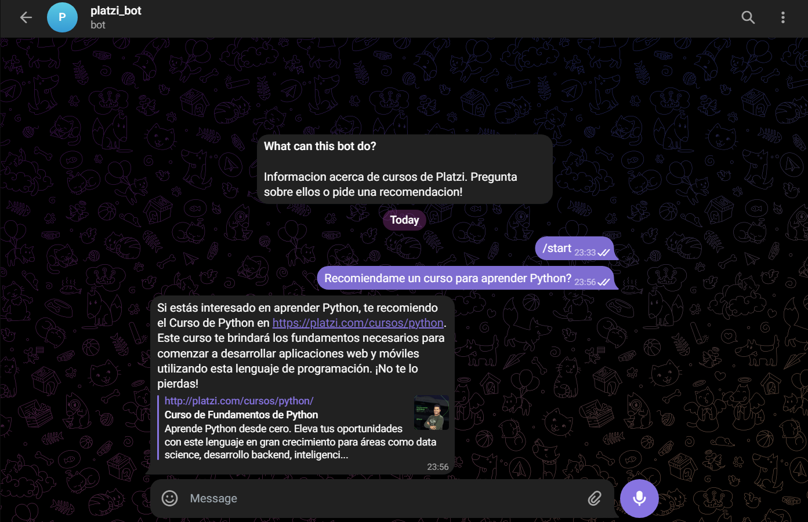

# chatbot_openai_model
Fine tuned chatbot with OpenAI models

This repository contains the code and necessary resources for fine-tuning OpenAI models and creating a Telegram chatbot capable of recommending courses from the Platzi educational platform.



## Project Description

The goal of this project is to develop a Telegram chatbot that can interact with users and provide course recommendations from the Platzi platform based on their interests and learning needs. We use pre-trained language models from OpenAI to achieve natural and effective conversation.

## Key Features

- **Natural Conversation:** The chatbot uses pre-trained language models to maintain coherent and understandable conversations with users.

- **Personalized Recommendations:** Based on the user's preferences, the chatbot recommends specific Platzi courses that align with their interests.

- **Integration with Telegram:** The chatbot integrates with the Telegram messaging platform, allowing users to interact with it conveniently.

## Usage Guide

### Prerequisites

- NLP and neural networks understanding.
- Python libraries as specified in `requirements.txt`
- Telegram account to configure the bot.
- OpenAI API Token

### Configuration

1. Clone this repository.

2. Create a virtual environment and install dependencies using `pip install -r requirements.txt`.

3. If you want to train, You will need an appropiate format (JSONL) that OpenAI models require for fine tunning. You can convert the data with the following command:

```bash 
openai tools fine_tunes.prepare_data -f datasets/data.csv
```

4. [Create a bot on Telegram](https://core.telegram.org/bots#botfather) and obtain your API token.

5. Configure the API token in an enviroment variable or use `load_env` and generate a .env file.

### Execution

Run the main chatbot script using the following command:

```bash
python chatbot.py
```